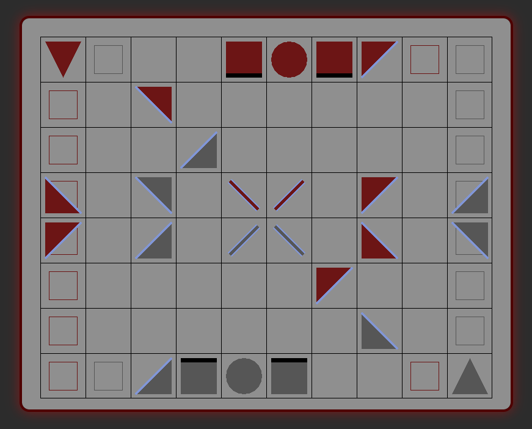

# KhetAI

An AI engine and multi-platform implementation for the board game [Khet](https://en.wikipedia.org/wiki/Khet_(game)).

This project started as a Ruby gem and over time, new ways to interact with the core C code were built (see the [Subprojects](#subprojects) section below).

---

## AI Engine

The core AI engine is written in C for performance and uses bit-packing, alpha-beta pruning, and Zobrist hashing. The code lives in the [ext/khetai](/ext/khetai) directory.

Example (via the Ruby gem):

```ruby
require 'khetai'

board = ["L2", "--", "--", "--", "A2", "X2", "A2", "P1", "--", "--",
         "--", "--", "P2", "--", "--", "--", "--", "--", "--", "--",
         "--", "--", "--", "p3", "--", "--", "--", "--", "--", "--",
         "P0", "--", "p2", "--", "S2", "S3", "--", "P1", "--", "p3",
         "P1", "--", "p3", "--", "s1", "s0", "--", "P0", "--", "p2",
         "--", "--", "--", "--", "--", "--", "P1", "--", "--", "--",
         "--", "--", "--", "--", "--", "--", "--", "p0", "--", "--",
         "--", "--", "p3", "a0", "x0", "a0", "--", "--", "--", "l0"]

whose_turn = 1          # silver = 0, red = 1
max_search_depth = 25   # between 2 and 25
max_search_time = 5     # in seconds

move = KhetAI.move(board, whose_turn, max_search_depth, max_search_time)
#=> [start_index, end_index, rotation]
```

---

## Subprojects

### [sdl-ui](/ext/khetai/dev/sdl-ui)

Uses [SDL3](https://github.com/libsdl-org/SDL) for its rendering and input processing. The laser is animated in real time using vector math and the pieces are all drawn with `SDL_RenderGeometry` calls. It also runs in the browser via WebAssembly, compiled with Emscripten.

<a href="https://jkugs.github.io/">
  
</a>

Playable here: [https://jkugs.github.io/](https://jkugs.github.io/)

Located in the [ext/khetai/dev/sdl-ui](/ext/khetai/dev/sdl-ui) directory.

### [fltk-ui](/ext/khetai/dev/fltk-ui)

A C++ FLTK GUI that allows manual testing of the AI and gameplay. Supports live reloading of the AI during runtime using `Shift + K`.


Located in the [ext/khetai/dev/fltk-ui](/ext/khetai/dev/fltk-ui) directory.

---

## Ruby Gem Notes

### Install

    $ gem install khetai

## Development System Requirements

To build the gem from source, you'll need:
- Ruby >= `2.3.0`
- GCC or compatible C compiler
- Development headers (usually provided by ruby-dev or ruby-devel package)

## Build and Deploy Commands

This project uses `asdf` as the version manager for Ruby. However, any Ruby version >= `2.3.0` should work to compile this gem.

    $ gem install bundler
    $ bundle install
    $ bundle exec rake compile
    $ bundle exec rake build
    $ gem install pkg/khetai-<version>.gem

Once tested and verified, bump the version number in [lib/khetai/version.rb](lib/khetai/version.rb) and commit changes.

To release and push to rubygems.org:

    $ bundle exec rake release

To push a pre-built gem manually:

    $ gem push pkg/<gem>

---

#### Why Does This Exist?

To build and learn from... 🐢
