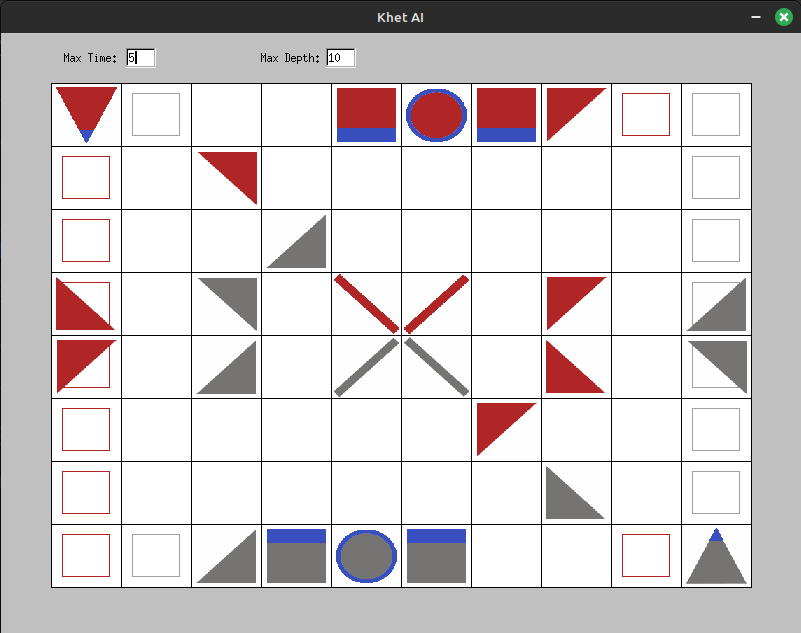

# KhetAI Test Harness

## Overview

The KhetAI Test Harness provides a GUI for interacting with the KhetAI library. It is built in C++ using the Fast Light Toolkit (FLTK).

### Hot Reloading (in progress)

Now compiling the Khet AI (C) functionality into a shared object and using that to call the AI from the GUI. The next step is to add a way to recompile it while the GUI is running.

### Select and Move Piece

- **Click** a square with a piece on it.
- **Click** another square. If there is a piece on it, the two pieces will swap. Otherwise, the piece from the first square will just move to the newly selected square.

### Rotate Piece

- **Arrow Keys**: Rotate a piece after it has been clicked. Use the following keys to rotate the selected piece:
  - **Left Arrow**: Rotate piece counter-clockwise
  - **Right Arrow**: Rotate piece clockwise

### Fire the Laser

- **Space**: Fires the laser from whichever is selected. This is just used for visualization purposes.

### Request AI Move

- **Enter**: Uses khetai_lib to determine a move for Red. The pieces will move and the laser will fire automatically once it finishes.

