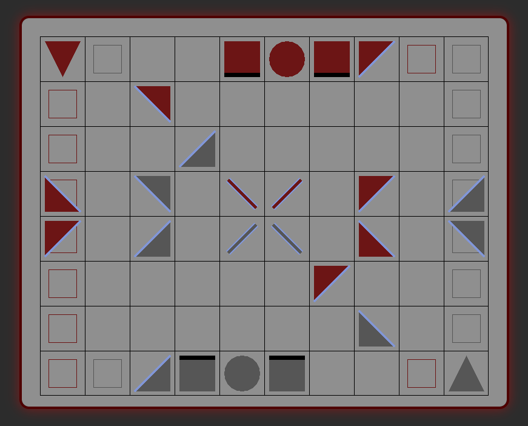

# Khet SDL3

## Overview

A Khet game built with SDL3. Uses KhetAI for moves. Can be compiled for WebAssembly using Emscripten.

### Note

The laser animation runs in real time using 2D physics-based reflections and all of the pieces are drawn using `SDL_RenderGeometry` calls. This was mainly just to learn more about SDL and 2D rendering.

---

## Controls

- **Mouse Click**: Select and move Silver piece
- **Arrow ← → Keys**: Rotate selected Silver piece
- **KhetAI**: Automatically makes a move after a Silver piece is moved or rotated
- **Spacebar**: Manually fire laser (does _not_ affect game state)
- **Enter**: Trigger a Red (AI) move (does affect game state)

### Mobile

- **Swipe Right or Left**: Turn selected Silver piece right or left
- **Swipe Up**: Manually fire laser (does _not_ affect game state)

---

### Building & Running: Desktop

```bash
cmake -S . -B build
cmake --build build/
./build/khet-sdl
```

### Building & Running: WASM

```bash
source ~/path/to/emsdk/emsdk_env.sh
emcmake cmake -S . -B build-wasm -DSDL3_DIR=$PWD/SDL3-wasm/build-wasm
emmake make -C build-wasm -j4
emrun --no_browser --port 8080 build-wasm
```

Then open [http://localhost:8080](http://localhost:8080) in your browser.

---

### Setup SDL3 for WASM (one-time)

```bash
git clone https://github.com/libsdl-org/SDL.git SDL3-wasm
cd SDL3-wasm
git checkout release-3.2.x
mkdir build-wasm && cd build-wasm
source ~/path/to/emsdk/emsdk_env.sh
emcmake cmake .. -DSDL_TESTS=OFF
emmake make -j4
```

---

[Enjoy](https://jkugs.github.io/)

<a href="https://jkugs.github.io/">
  
</a>